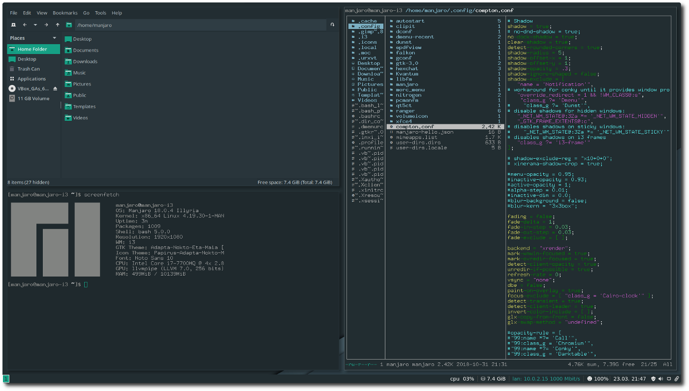
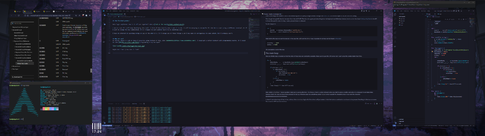
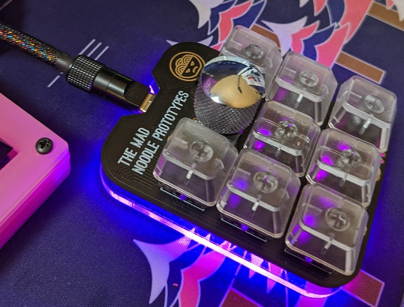

It's true. But it's for a good reason, promise.

One of the best things about tiling window managers like [i3m](https://i3wm.org/) is the ability to launch a terminal from anywhere by pressing a simple key combination like `alt+enter` and have it open in the correct place.



<span style="text-align: right;font-size:8pt">
image courtesy of <a href="https://medium.com/@ashwinvasudevan96/moving-from-ubuntu-to-manjaro-i3-window-manager-e13cd195ed7d">ashwin @ medium</a>
</span>


Looks pretty, right?

While I haven't exactly replicated the putting it in the right place part yet, [MS PowerToys](https://docs.microsoft.com/en-us/windows/powertoys/) makes it easy to snap it to a particular zone once the terminal has been launched. Good enough for now.

## Enter `k`

`k` is a [simple program](http://github.com/keeb-dev/k) that spies on the keyboard, waiting for the magic character combination.

Once detected, it launches the editor of my choice.

The main magic resolves around polling of the 2 keys we are interested in, the `Enter` key and the `Win` key (specifically LWIN in this case.)

## Windows Programming

Windows is kind of cool. I've been giving it a real shot to make it my main development environment over the past few months. You may remember [I started my journey programming](/2022/05/28/The-beginning/) on Windows. Nostalgia!

One of the things that makes it cool is that interacting with it is pretty straightforward through the [WIN32 API](https://docs.microsoft.com/en-us/windows/win32/api/). For an extra layer of fun, let's do it in Golang.

First we get the specific function we want from the win32 API. The docs do a great job describing how the keyboard and Windows interact, but to cut to the chase [GetAsyncKeyState](https://docs.microsoft.com/en-us/windows/win32/api/winuser/nf-winuser-getasynckeystate) is the API to know the specific state of a key - nada, pressed down or released.

So, let's import it.

```golang
var (
	user32   = syscall.NewLazyDLL("user32.dll")
	keystate = user32.NewProc("GetAsyncKeyState")
)
```

Next, define the keys we want to look at, in this case the `LWIN` and the `Enter` keys. Keycodes for all keys can be found [in the docs](https://docs.microsoft.com/en-us/windows/win32/inputdev/virtual-key-codes)

```golang
enterKey := 0x0D
winKey := 0x5B
```

OK. Boilerplate is out of the way.

## The main loop

Now an infinite loop is needed so that the state of these keys are constantly available. Make sure to give the CPU some rest. I can't press the combo faster than `50ms`. 

```golang
for {
    enterState, _, _ := keystate.Call(uintptr(enterKey))
    winState, _, _ := keystate.Call(uintptr(winKey))

    if winState > 1 {
        if enterState > 1 {
            if !enterDown {
                fmt.Println("we did it!")
                enterDown = true
            }
        } else {
            enterDown = false
        }
    }
    time.Sleep(50 * time.Millisecond)
}
```

Wait, what's `enterDown` ? Good question. Glad you're paying attention. The thing is, there's a delay between when you start to press a button and when it is released. It even takes time, however short, for a key to travel from pressed, to fully up. Windows also has something called `repeat` which repeats the character press if you hold the character downnnnnnnnnnnnnnnnnnnnnnnnn.

`k` doesn't care about any of that. In fact, without the `enterDown` logic all of the other stuff just makes `k` think the button combination continues to be pressed. Resulting in hilarious outcomes like spawning 600 terminal windows.


## The finished product

Main logic explained. How is it all put together? Take a [look at the repo](http://github.com/keeb-dev/k). 

I am not sure if I will keep developing this tool. It kind of does exactly what I want it to do. It will be annoying to recompile if I decide to start using a different terminal. Or if I want to change the key combination. Or if I happen to want another macro to do something else.

I have no interest in spending energy on all of the what if's. If I change any of those things a lot I may make it configurable to some extent. But I probably won't.

How does it look?

[](I-made-a-keylogger/desktop-full.png)


## Why not use?
Of course, there's a lot of tools I could be using instead of this, like [AutoHotKey](https://www.autohotkey.com/). I could get a better keyboard with programmable macros. Or I could do some [QMK](https://docs.qmk.fm/#/) programming on my macropad?



Maybe next time :) 