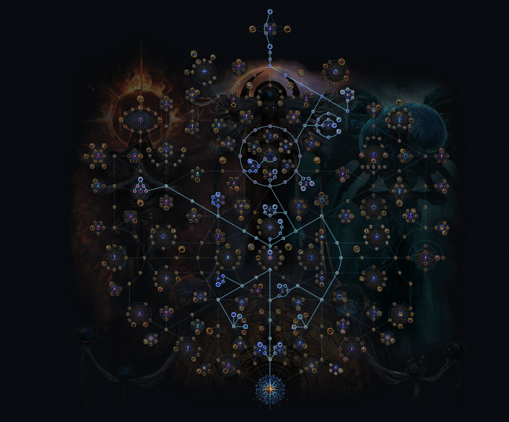
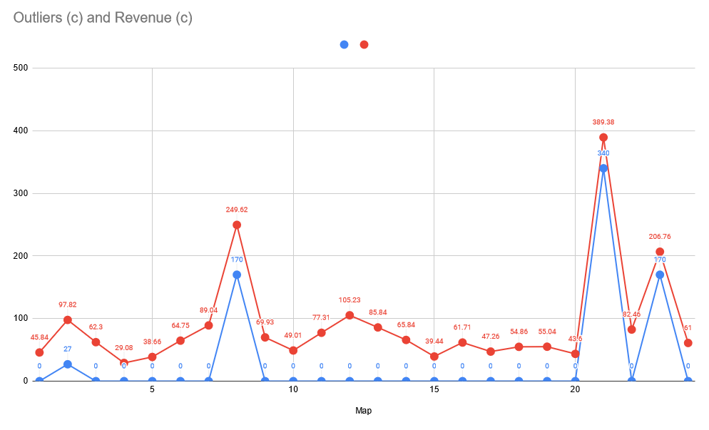

We're 7 days into one of the most catastrophic launches for Grinding Gear Game's [Path of Exile](https://pathofexile.com) new league, [Lake of Kalandra](https://pathofexile.com/kalandra)

Some charts point to the fact that as many as `50%` of launch day concurrent users have stopped playing the game. This is in stark contrast to previous, successful leagues. 

Many streamers/content creators have taken a break or outright stopped playing.[Reddit](https://pathofexile.reddit.com) has been up in arms. It seems everywhere you look, there's a lot of negativity and not a lot of positivity.

The controversy stems from a very real fact: a fundamental change to the game (AND GENRE) - `loot` - was changed and not communicated. At all. 

Absent any information, doom set in immediately. From diuscussions of `Anchoring` to Boycotts.  

Controversy aside, the questions in my mind have been: 
* How severe are the changes?
* Am I wasting my time?
* Is the fear around rewards being more `spiky` warranted?

If you just want the numbers, here they are.

# tl;dr 72c / map profit
* Total revenue (c) - 2,171.78
* Profit per map (c) - 71.49
* Total profit (c) - 1,715.78
* Profit (d) - 10.09

Take away the outliers (big drops worth more than 10c)
* Revenue without outliers(c) - 1,464.78
* Profit without outliers(c) - 1,008.78
* Profit without outliers(d) - 5.934 

# The setup

*click on the image to see on poeplanner.com*

## Method

24 T16 `Crimson Temple` Maps. Fully unlocked Atlas. 115/115 bonus. All watchstones socketed. Scarabs did not directly add monsters but affected monster rewards. Atlas tree is generic - Essences, Strongboxes, Exiles, and Red Altar.

Maps hand rolled - Chisel and Alch. Maps were rolled to >90% quant (most at >100%). No cannot regen mods, otherwise good.

If you're wondering how I tracked per-map returns: Each map had a dedicated tab. All stash tab affinities were turned off (except heist.) All loot went into each tab. 

Exilence Next was used to calculate the revenue. 

Outliers are any item worth more than 10c. In this run, 4 raw `Divine Orb`'s dropped so these make up the predominant outliers.

## Some looting rules

Actual profit was more than is reflected here because of the following rules/constraints

* All `Ritual` rewards were deferred
* Did not pick up any `6 socket` or rare items
* Did pick up 6 links but did not convert to fusings. They are not in the calculations. 
* Heist rewards were not calculated.
* Influenced maps that dropped were calculated as their base map without influence (2c vs. 20+c)

## Investment - 456c total. 19c/map

| Name                     | Price |
| ----                     | ----- |
| Crimson Temple Map (T16) | 5c    |
| Essence on Map Device    | 2c    |
| Polished Ambush          | 2c    |
| Polished Cartography     | 2c    |
| Polished Reliquary       | 2c    | 
| Polished Divination      | 2c    |
| Awakened Sextant         | 1.5c  |
| Chisels/alch/scour       | ~2c   |
| **Per Map Investment**   | 19c   | 
| **Total Investment**     | 456c   | 

# Returns

| Map |	Outliers (c)| Revenue (c)| 
| --- | ---         | ---        | 
| 1   |	0           | 45.84      | 
| 2   |	27          | 97.82      |
| 3   |	0	        | 62.3       |
| 4   | 0	        | 29.08      |
| 5	  | 0	        | 38.66      | 
| 6	  | 0	        | 64.75      | 
| 7	  | 0	        | 89.04      | 
| 8	  | 170	        | 249.62     |
| 9	  | 0	        | 69.93      |
| 10  | 0	        | 49.01      |
| 11  | 0	        | 77.31      |
| 12  | 0	        | 105.23     |
| 13  | 0	        | 85.84      |
| 14  | 0	        | 65.84      |
| 15  | 0	        | 39.44      |
| 16  | 0	        | 61.71      |
| 17  | 0	        | 47.26      |
| 18  | 0	        | 54.86      | 
| 19  | 0	        | 55.04      |
| 20  | 0	        | 43.6       |
| 21  | 340	        | 389.38     |
| 22  | 0	        | 82.46      |
| 23  | 170	        | 206.76     |
| 24  | 0	        | 61         |

# Conclusions

Sample size is low. Needs more data. Rewards don't appear to be too spiky. Graphing the outliers per map seems relatively consistent to median. Felt good to get the big drops and accounted for about `40%` of the profit. 

Was this run lucky? I don't know. 

Did I have fun? Yes.

Was it a waste of time? No.

Would I have made more last league doing the same thing? No idea.

Do I care? No.

# Testing Next 

I have a lot of questions worth testing / investigating.

How do you get `MORE RARE MONSTERS` in each map?

Fully investing in `Rogue Exiles` + `Seance` + `Rogue Bodyguards` with `Reliquary Scarabs` to really boost the the rarity bonus seems good.

Rarity on gear seems worthwhile to optimize.

How valuable is the loot in the league mechanic? Since it is in a separate zone, it can be measured separately relatively easily.

