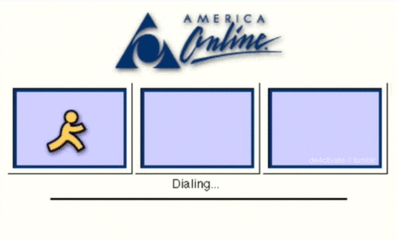
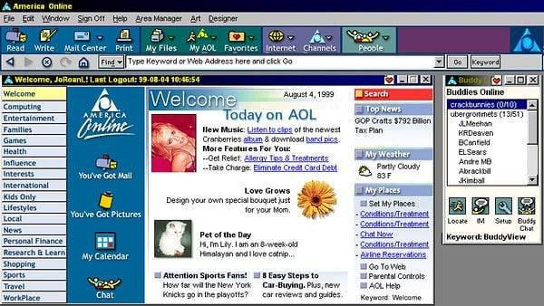
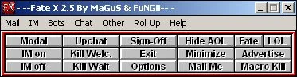
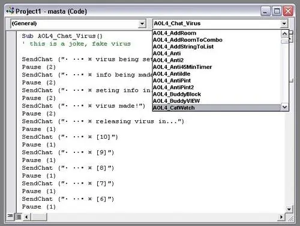
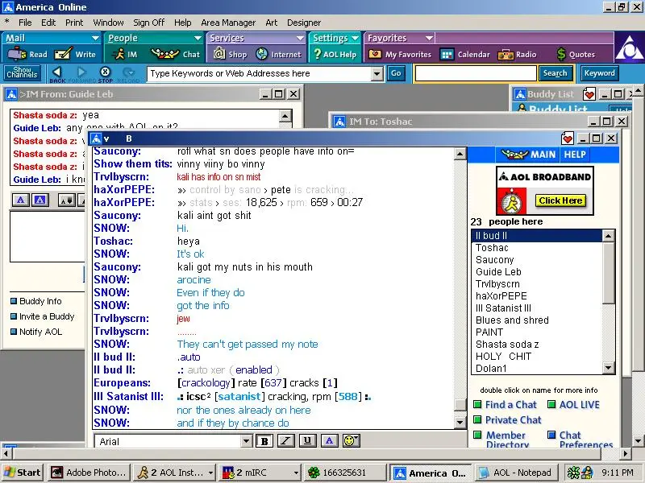

From the earliest days I can remember, I have been in love with technology. My first real computer memory was playing a game called [Mad Dog Mccree](https://en.wikipedia.org/wiki/Mad_Dog_McCree), published in 1993 on for MS-DOS by IBM on some version of the Tandy home computer. 

I was 8 years old, and I had no idea what I was doing, but I was having fun.

It wasn't too long after this, my parents, who were vehemently against this new fangled thing called "The World Wide Web" went on vacation and left us kids and a devious aunt with a bunch of blank checks in order to pay for groceries or any other emergencies that cropped up. At the time, [America Online (or AOL)](https://en.wikipedia.org/wiki/AOL) allowed you to sign up and pay by entering an Account Number/Routing Number, and so we did. 

My parents none the wiser, 8 year old me and my siblings had unfettered and unmonitored access to the Web. And what a wonderful thing it was.

## Early AOL Days - A/S/L??

What made AOL unique was the easy access to a variety of chat rooms, both public and private. This was entirely the point of AOL. On AOL, the internet was primarily accesed through `keywords` instead of URLs. The experience, however, was ceneted around email, chat rooms, and instant  messaging. This meant that you would be quickly immersed and interacting with people from all walks of life.

Sucked into this new found hobby, chatting away with anyone and everyone, a few trends start to make themselves. Really obvious ones like the now infamous `A/S/L?` (which stood for `age/sex/location`,) but also some more subtle ones such as new fields and colors in peoples profiles, people setting themselves as away with auto responders, anti idle tools to keep themselves online, and the infamous `PUNTER`. 

Connecting to AOL was a pain in the ass, required a computer modem to dial another computer. The internet was slow. Connecting took time. Sometimes the phones were busy or you were stuck in a handshake sequence for what seemed like ever. Getting kicked off once you were on was a big deal, and being on the receiving end of this was **INFURIATING.**

Of course, figuring out how to do this was step #1. What is `Fate X by MaGuS & FuNGii` or `AOHell`? The path of finding out consumed me. Then later, after using them and finding my way to Private Room: VB, I became addicted. It turns out [I was not alone.](https://github.com/readme/featured/aol-programming-culture)

 

## Decompiling

Like any noob on the internet who has no idea what is going on, I started asking people where they got these `progs`? who made these `progs`? and where can I learn to make my own `progs`?

Some helpful internet person told me to figure out how to make them, I needed something called a decompiler and I could point this decompiler at the prog in question and find out how it was made. This helpful person then sent me a decompiler over AOL Email and in returned asked me to give him any code I thought was cool that I found.

I did as I was told - but I had no idea what I was looking at and I had no idea what was cool or not. I remember vividly decompiling FateX for the first time and getting hundreds or Visual Basic *.frm* files cascading all over my screen. It would be a while before I returned to this.

## VB .bas culture ##

The anatomy of a prog was pretty straightforward - almost all progs were written in Visual Basic. Visual basic has `.frm` files - the window that gets displayed when your prog launches, `.bas` files, which were modules, or libraries, that contained generic functions that could be called that you'd use in buttons or in menus of your Forms to do certain things. 

If you were really cool, you published your own ActiveX control which hid the implementation of your methods, but could still be distributed and used by others in your VB App.

Probably the most common method in all `.bas` files was some variation of `SendChat` or one of its aliases, *AOL25_Send_Chat*, *SendMessage* and the like did exactly what the method describes - sends some text to the chat.

Reading about some peoples nostalgic experiences, they mistakenly thought the way to do this was using the native windows `SendKeys` command. This was prone to error because the API sends keys to the active window only. Only the noobest of noobs used this method and would get your prog laughed out of the room. The tradeoff is that progs were not portable across AOL versions due to the way the client was updated. No one ever thought to make these things generic, so we just made version specific methods instead.

At this time, *Open Source* was not really as prevalent or as common of a term as it is today. In the progs scene, it became increasingly embarassing to be accused of or to engage in decompiling other peoples progs. Not cool. Copying and working on your own version of ideas was fair game, and [sites started to pop up](https://members.tripod.com/~poLAr_/bas/bas.htm) with famous prog authors `.bas` [files.](https://psackley.tripod.com/vb/files.html) Sites like this kicked off a whole slew of innovation, hackers were making a name for themselves, you could show your code was not stolen, sharing started to become a way to show off, and indirectly to push the envelope.

I think the most famous `.bas` and elite coder of the time was [dos32.bas](The-beginning/dos32.bas). DoS was a pioneer and someone all of us in the hacker scene owe a huge debt of gratitude. He provided good, clean reliable code that just worked and were one of the first publishers of code for doing `ccom` - or chat commands. A craze that really changed the entire dynamic of hacker subculture on AOL.

## keeb is born ##

Immersed in internet progs subculture, one thing was clear, the name that I had been using (*leplik????*) wasn't going to cut it. I tried all sorts of dumb names, some of which you'd expect, but a girl I happened to have a crush on at school had started calling me her "little keebler" (thanks, Maribel) because I have always been small and short for my age. I thought I'd be funny and shorten "keebler" to `keeb` - so like DOUBLE short. Ha ha.

Armed with my new handle, and a bit more knowledge, it was time to get back to work. This time, I started reading and using people's `.bas` files and doing simple things. My favorite thing to do was to figure out how exactly certain features worked and reimplement them.

## From buttons to ccom, or chat commands

Early version of progs were UI/button driven. Click on a button on a form, perform an action in AOL. As time went on, however, a new type of interaction was conceived: chat commands. 

Now instead of having to click a button on a ui `punt` then enter someones name to punt, you could type in chat `.punt <victim>`. The proggie would then dutifuly register your request by sending to the same chat `-._,-> target acquired: <victim>` or some such weird concoction of cool ASCII characters to let everyone know you just owned some noob.

After a while AOL VB chat basically devolved into people developing these progs in the open, mostly interacting with their commands as they were tinkering with them. 

## Things I made

Sitting here typing this, I wish I could find a remnant or example of anything I had actually made at the time. There's a cliche saying that the internet never forgets; I don't think that's true. The internet forgets rather quickly. I used to be able to find `keeb232.bas` listed. Now it's nowhere to be found.

Over the course of my time programming AOL progs I made a clone of every type of prog there was from punters and faders to various utilities like profile updaters, sound killers, modal window killers, turning im/buddy lists on and off, appearing offline, etc. My crowning achievement, at the height of the MP3 craze, was building a text-driven music player that could be used in any window. 

At the time, chat commands were basically confined to the main AOL Chat Room window and as a result, all commands needed to be typed in that window in order for progs to function. 

What I remember doing is developing a 2 step process. 

Step 1 was "find text mode" where I could query the windows API's in realtime as the mouse cursor moved to get information about the window (I believe using calls like `WindowFromPoint` in `winuser.dll`,) and upon hitting `ALT+Enter` key combo, it would attempt to SetText. If it was successful, then that would be the window that would be polled to receive commands from and send commands to. 

Step 2 was a race condition in 2 `Timers` (think of them like threads.) Timer1 was focused on polling said input for specific commands like `.play metallica`, waiting for a `Enter` key to be pressed. Timer2 was focused on invoking the appropriate method, clearing the text window, and returning the result of the command to the window. Getting this timing down was important because sometimes a command would loop 2-3 times if the tolerance wasn't set correctly.

## The death of my brother

On March 26, 1997, I was a few months away from my 12th birthday. My parents were out of town again and that same devious aunt was staying at my house taking care of us. 

My brother had just turned 17 the month prior and was recently grounded because he crashed his truck fucking around doing donuts in a parking lot and on top of that my parents had caught him sneaking out at night to visit his girlfriend. My parents found out he was sneaking out when at 2am there was a ring at our doorbell. Answering the door, a police officer had my brother in handcuffs and asked if he was indeed their son. After confirming, the police officer went on to explain that he had seen my brother turn the car off at the end of our long driveway and start pushing it to the house. The police officer thought this was suspicious and didn't believe my brother when he told him what was happening. 

It then dawned on them that his "sleep walking" tripping the alarm in the middle of the night and the fact that there was a ladder next to the house that just so happened to be under his bedroom window weren't coincidences.

Yeah, my parent's werent too bright.

Anyway, so my brother's grounded, my parents are away from home, and my aunt and cousin are staying with us and there's school the next day and we've all got homework to do. Well, my cousin needs an information packet from a school friend and of course my brother volunteers to drive and get it, even though he's not supposed to. 

Amazingly, everyone who was home lined up at the door as he left and gave him a hug and told him to drive safe and that we loved him. I hope he knew it. My brother proceeds to take my grandmothers car and proceeds to joyride, taking the backroads to get the paperwork, and in his excitement takes a corner going way too fast and slams into a tree, killing him instantly. He didn't have a seatbelt on. An off duty paramedic happened to be behind him and came up onto the scene seconds after the crash and called it in.

Wondering where my brother was I see lights in the driveway, and I am excited he is home. Suddenly there's a knock on the door, which is weird, and I go to open it and it's a police officer. He asks if an adult is home and it's all a blur after that. 

Talking to my parents and confirming to them their son and my brother was dead was really difficult.

## Inward and onward

If I was addicted to tech before, I am obsessed now. Programming is my escape. Skateboarding is freedom. Since this time I have spent most of my waking life in some form or fashion hacking on computers, thinking about hacking on computers, or applying my love of technology to business and dreaming about how to combine technology to build something interesting, unique, fun.

I don't actually remember the last time I logged onto AOL. For a lot of things, you really don't plan on for the last time doing it. It just happens. 

What I do know is I owe a great deal to this part of my life. Through AOL I learned about how to rebuild computers, how to automate tasks, how to read code, how to collaboarate and ask questions about code, how to write code. About warez and cracks and falling in love with chiptunes.

I was instilled with a lifetime passion for collaborating and learning in the open. I was able to meet some amazing people, including the ridiculously talented [ash](https://twitter.com/ashr0se). AOL was my home, more than any physical space. Born and raised on the internet.

Thanks, AOL.